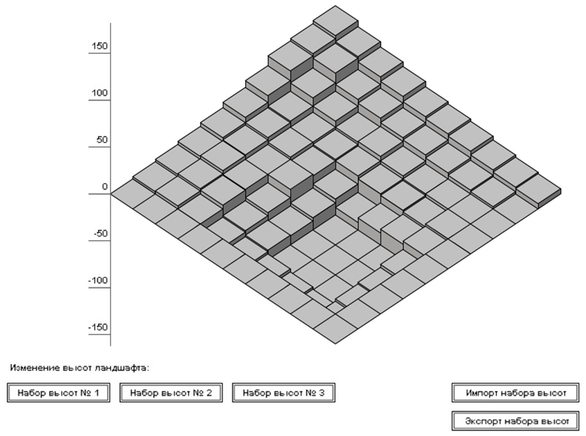
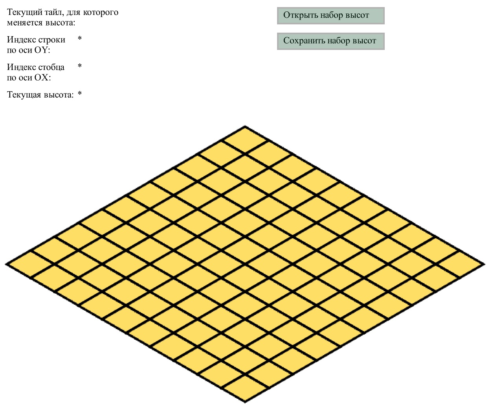
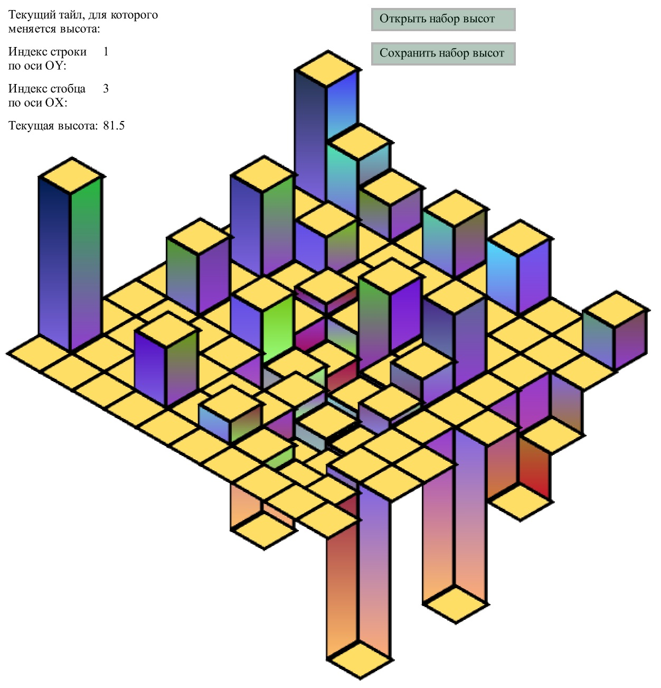
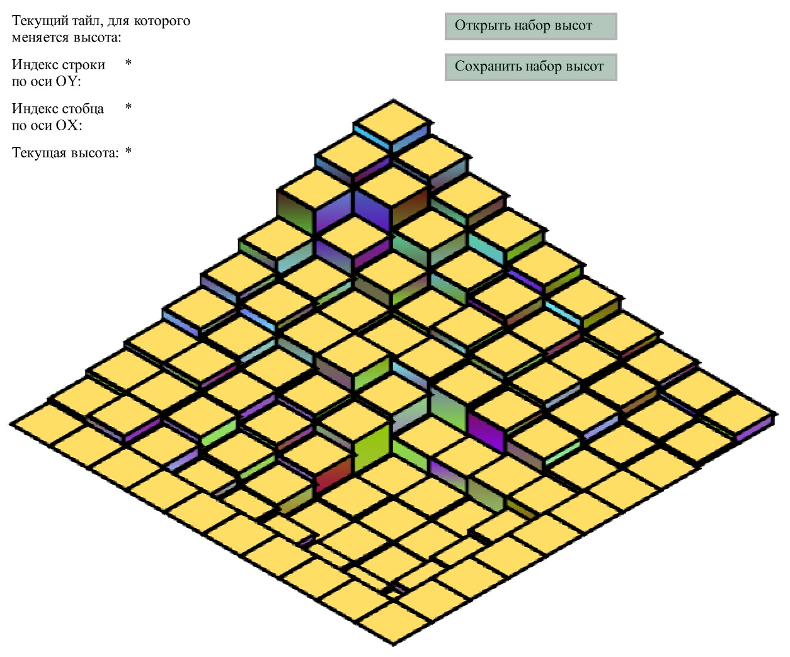
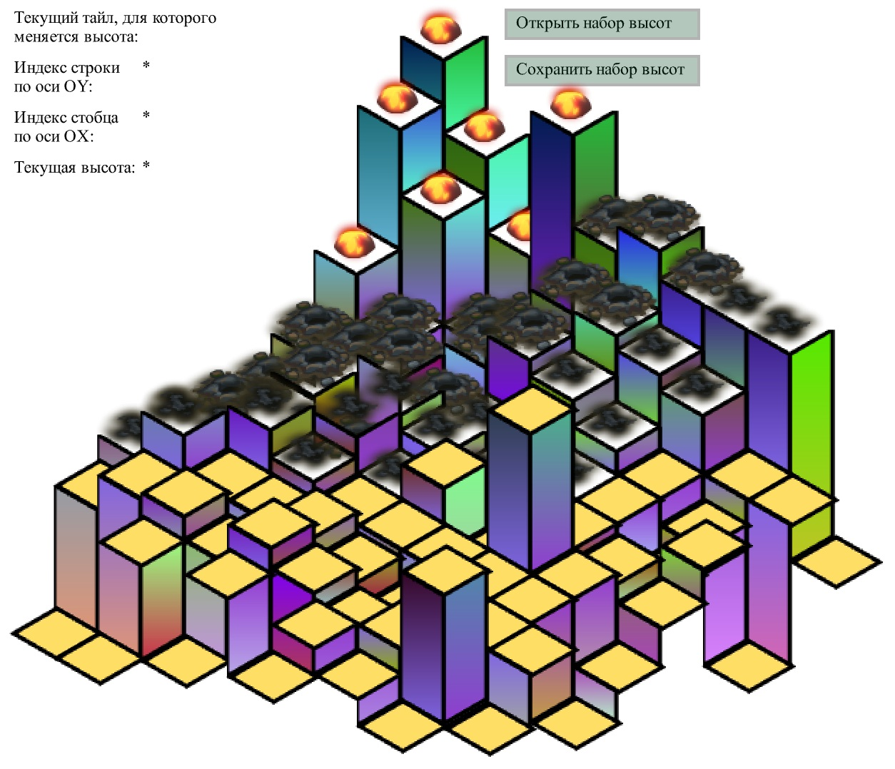

# Реализация тестового задания "Холмистый ландшафт" (HillyLandscape)

## Средства разработки
- **Среда разработки**: IntelliJ IDEA.
- **Язык программирования**: ActionScript 3.0.

## Задание

Есть ландшафт, состоящий из тайлов, площадью 10 на 10.
Необходимо реализовать возможность задавать высоту для каждого тайла в ландшафте через набор высот.
По умолчанию все тайлы находятся на высоте 0, высота изменяется в пределах от -150 до 150.
Значения высоты указаны в пикселях.
Результат прислать в виде zip-архива c исходными файлами и скомпилированным приложением.
Дополнительный функционал:
- редактирование высот в рантайме;
- загрузка набора высот из файла;
- экспорт набора высот в файл.

## Решене

### >Есть ландшафт, состоящий из тайлов, площадью 10 на 10.
Сделала несколько вариантов тайлов, они загружаются из внешнего swf-файла.
Тайлы с неопределённым типом рисуются как формы.
Другие типы: земля, обугленная воронка после взрыва, кадр взрыва.
Площадь можно задавать через количество тайлов по осям OX и OY через атрибуты XML-файлов.
По умолчанию их 10 в каждой стороне.

### >Необходимо реализовать возможность задавать высоту для каждого тайла в ландшафте через набор высот.
По умолчанию у всех тайлов высота - 0.
Через XML можно загружать и сохранять высоты.
В атрибутах прописываются размеры. Если допущены ошибки, они корректируются: лишние ячейки отсекаются, недостающие дополняются.
Для каждого тайла помимо высоты задаётся его тип, чтобы взять для него соответствующую текстуру.

### >По умолчанию все тайлы находятся на высоте 0, высота изменяется в пределах от -150 до 150.
Да, так и сделала, эти настройки хранятся в константах и проверяются.
Проверять, привильно ли заданы высоты можно не только по xml,но и в реальном врмени: высоту перемещаемого тайла видно в текстовом поле (или в метке) на сцене.

### >Значения высоты указаны в пикселях.
Да, так и сделала: ячейки тайлов по осям OX и OY исчисляются в индексах координатной сетки, а высота - в пикселях.

### >Результат прислать в виде zip-архива c исходными файлами и скомпилированным приложением.
я сделала работу в Adobe Flash Professional, но на форме в дизайн-тайме там ничего не лежит, все компоненты я помещаю на форму в коде.
Там получился красивый отклмпилированный файл.
В IDEA я тоже сделала, там нет компонентов и параметры сцены проще, надо расширять окно, если хотите увидеть шире.
В самой среде запускается, но, если внешне запускать файл не из среды, то он не работает почему-то.
С  Adobe Flash Professional - всё нормально в этом плане.

### >Редактирование высот в рантайме.
Да, сделала.
Нажимаете кнопку мыши на верхней поверхности, то есть на грани и перетаскиваете курсор мыши: видно, как тайл перемещается, вертикальные грани меняются в размерах и цветовых решениях (сделала градиентную заливку).
Кроме того можно отследить текущую изменяемую высоту в текстовых полях.
Поля также показывают индексы строки и столбца, где находится изменяемый тайл.

### >Загрузка набора высот из файла.
Да, сделала.
Посмотрите файлы в папке Examples:
- файлы вида Data_mxn.xml - тесты для малых сторон;
- DefaultData - матрица по умолчанию, текстурированная тайлами земли;
- CorruptedData - повреждённые данные, в комментариях видно, какие ошибки я намеренно допустила;
- RecoveredData - этот файл был получен так: загружены повреждённые данные, проверены, откорректированы, а потом результат сохранили в этот файл, можете проверить, как это работает;
- InterviewTask - картинка, как дана в задании - построила такой ландшафт;
- MyBeautifulPicture - мой сюрреалистический пейзаж.

### >Экспорт набора высот в файл.
Там есть соответствующая кнопка, можно сохранять созданные ландшафты, и потом их загружать.

## Статус проекта
Проект завершён.

## Контакты
Котова Екатерина Александровна,
e-mail: katekotova_86@mail.ru